# SiemensJava2026
## This is the README.md for the first problem, there should be another one for the second problem, another .md file

# Solution:
I have developed a Spring Boot backend that handles the core business logic. I integrated Mailtrap for email functionality and created HTML templates for the frontend. Following the Model-View-Controller (MVC) pattern, the Model represents the data, the View displays it, and the Controller manages the interaction between the two. I also use DTOs for JSON communication. To keep the controllers lean, I implemented a service layer that handles all data processing and business rules.

## Prerequisites
Install the needed dependencies/springboot
Used Java version 23

## Client Options

## Overview

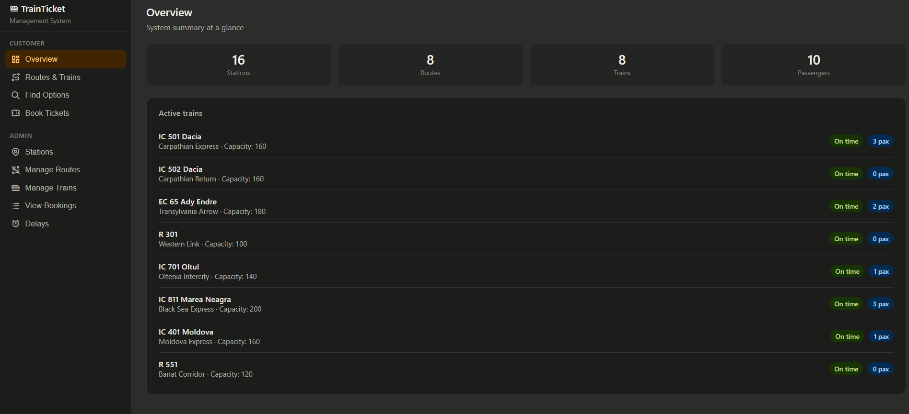

## Routes & Trains

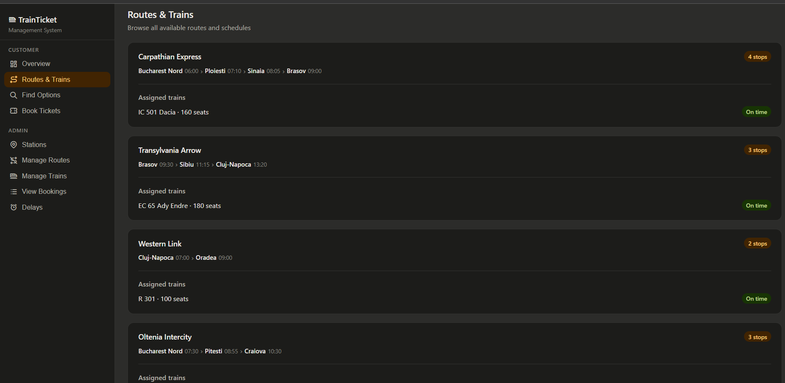

## Find Tracks

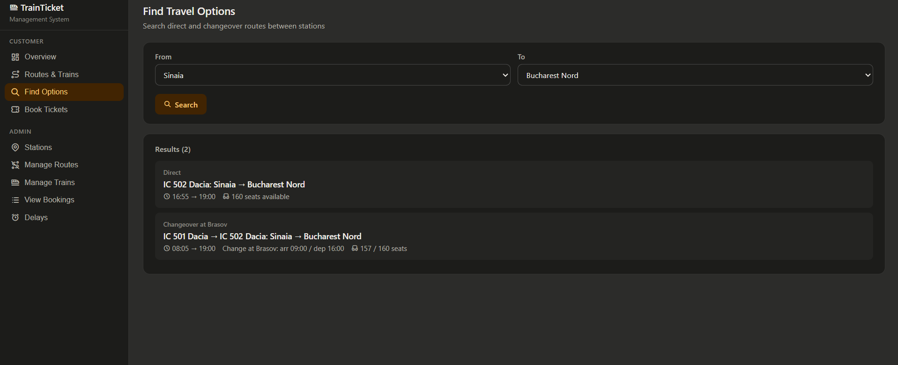

## Book Tickets

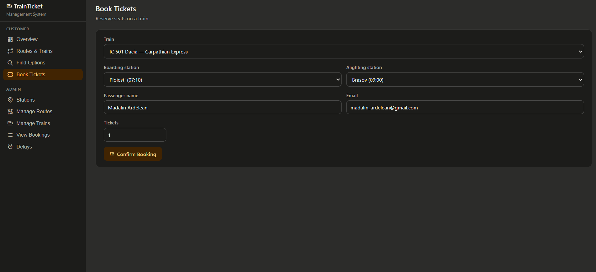

## Used Mail Trap for the email service
I needed a domain that I do not have to use a real email service. I do not have a device that runs non-stop to host my own dns server.

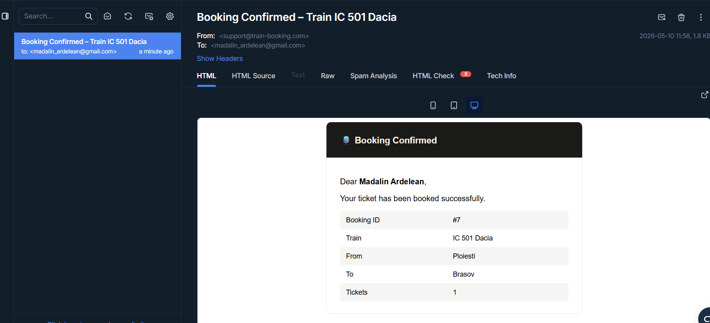

## Admin Options

## Stations Menu

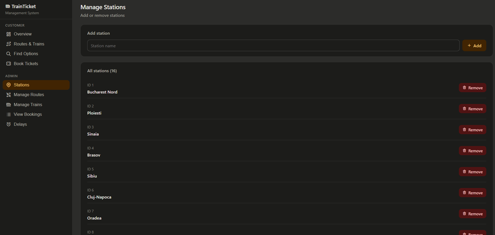

## Route Menu

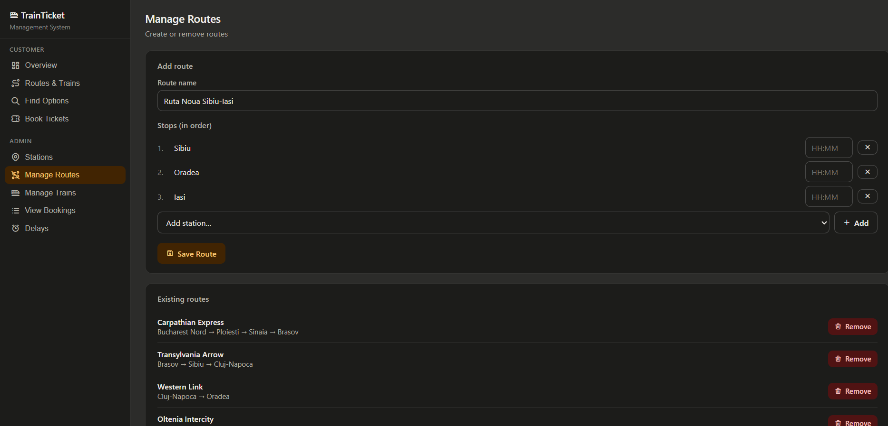

## Trains Menu

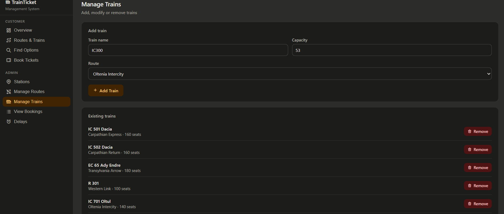

## Booking Menu

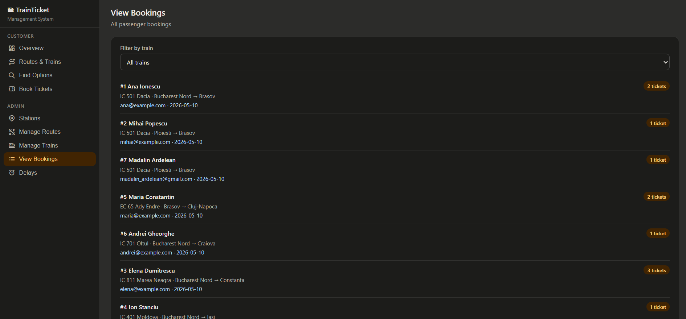

## Delay Menu

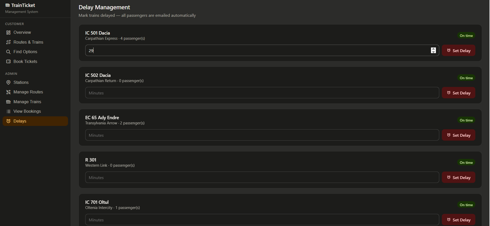

## Delay Effect

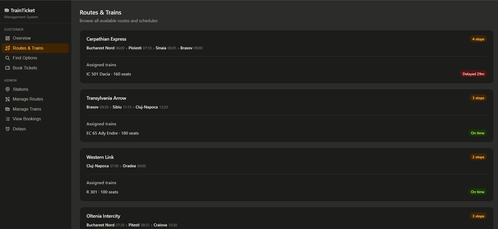

## Email Delay Notifier

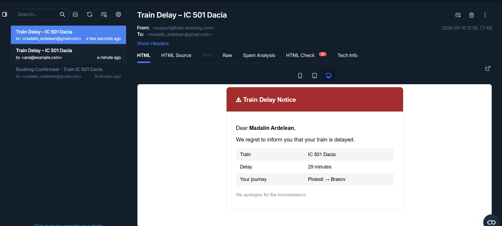

